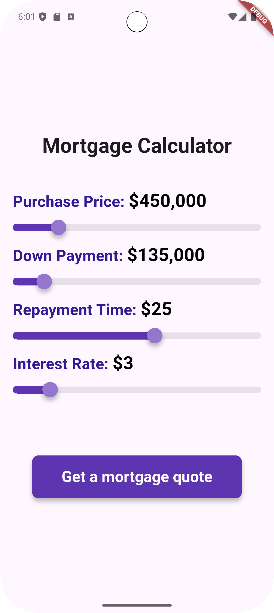
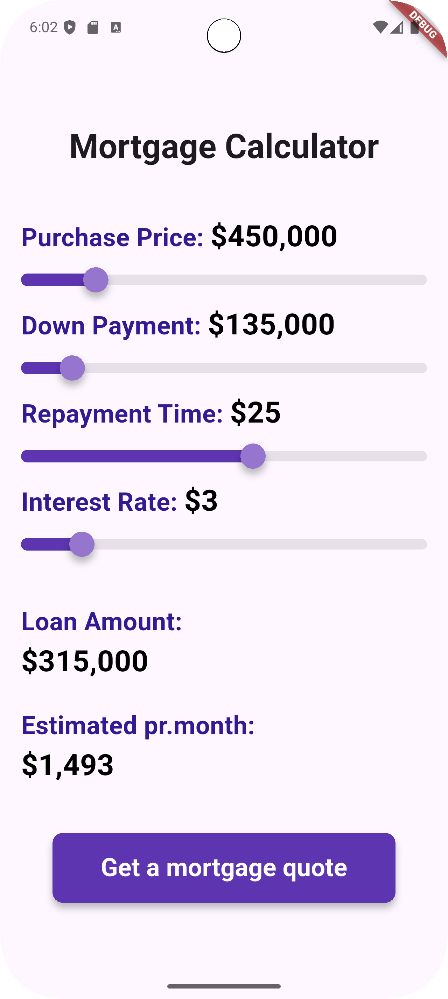

# 🏡 Mortgage Calculator Mobile App

This is an open source project from [DevProjects](http://www.codementor.io/projects).  
Feedback and questions are welcome!

🔗 Project requirements: [Mortgage Calculator Mobile App](https://www.codementor.io/projects/mobile/mortgage-calculator-mobile-app-d16e4dbmfl)

---

## 📖 Description
This Flutter application allows users to **easily calculate mortgage payments**.

Users can input the purchase price of a property, their down payment amount, the repayment time in years, and the annual interest rate. The app then calculates and displays the **total loan amount** and the **estimated monthly mortgage payment**.

---

## 🚀 Features
- **Dynamic Input:** Adjust values using interactive sliders for:
    - Purchase Price
    - Down Payment
    - Repayment Time (in years)
    - Interest Rate (annual)
- **Clear Results:** Instantly see:
    - Total Loan Amount
    - Estimated Monthly Mortgage Payment
- **Formatted Numbers:** All monetary values are displayed with commas (e.g., `52,000`) using the [`intl`](https://pub.dev/packages/intl) package.
- **User-Friendly Interface:** Clean, simple, and intuitive design.

---

## 📸 Screenshots & Demo



---

## 🛠️ Tech Stack
- **Framework:** [Flutter](https://flutter.dev/)
- **Language:** Dart
- **Packages:** [intl](https://pub.dev/packages/intl)

---

## 📂 Project Structure
```
lib/
│
├── main.dart # Entry point of the app
├── screens/ # UI screens (input, results, etc.)
├── widgets/ # Reusable UI components
└── utils/ # Helper functions (e.g., mortgage calculation)
```
---

## ⚙️ Installation & Setup

### Prerequisites
- [Flutter SDK](https://flutter.dev/docs/get-started/install) installed
- IDE: [Android Studio](https://developer.android.com/studio) or [Visual Studio Code](https://code.visualstudio.com/) with Flutter extension
- A connected emulator or physical device

### Steps
1. Clone the repository:

```
   git clone https://github.com/your-username/mortgage-calculator.git
   
   cd mortgage-calculator
```
2. Fetch all the necessary packages defined in the `pubspec.yaml` file:
```
    flutter pub get
    flutter run
```
---

## 📖 Usage

1. Launch the app.
2. Use sliders to set:
    * Purchase Price
    * Down Payment
    * Repayment Time (years)
    * Interest Rate (annual)
3. Instantly view the calculated:
    * Loan Amount
    * Monthly Mortgage Payment.

## 🤝 Contributing

### Contributions are welcome! 🎉

### To contribute:

1. Fork the repository
2. Create a new branch `(git checkout -b feature-branch)`
3. Make your changes
4. Commit and push `(git commit -m "Add feature XYZ" → git push origin feature-branch)`
5. Open a Pull Request
